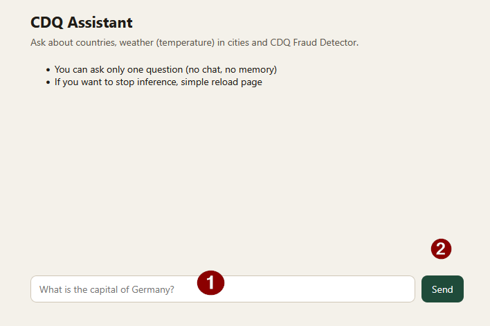
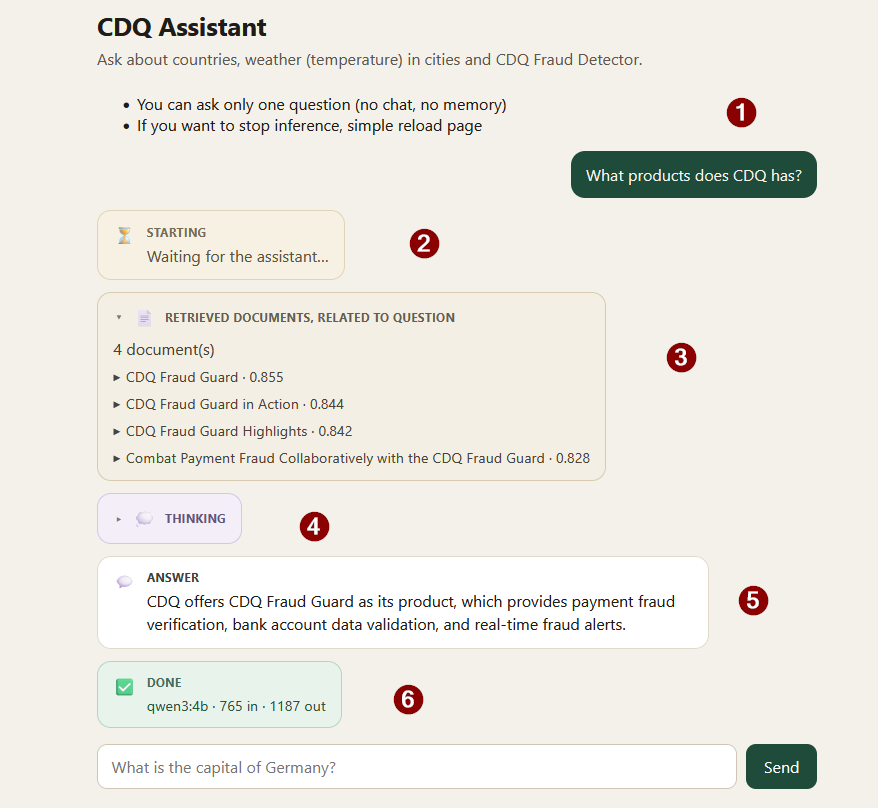
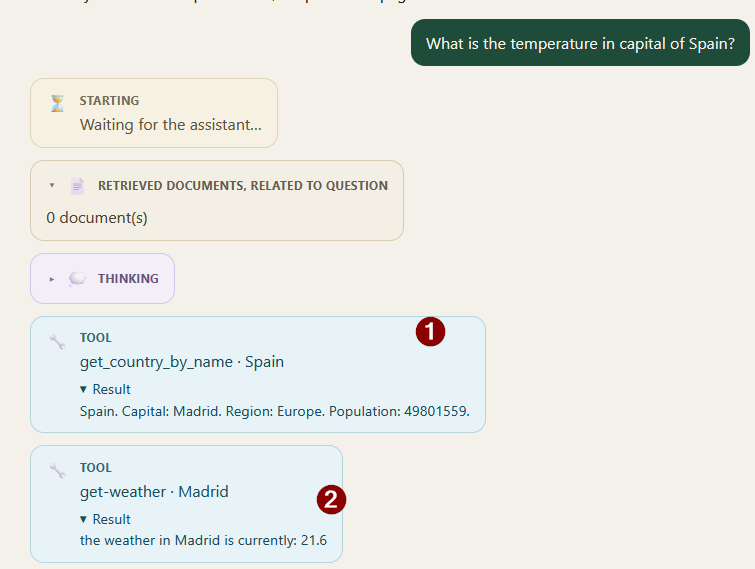

# CDQ AI assistant

Java assistant with a chat UI. It answers country and weather questions through MCP tools, and CDQ Fraud Guard questions through RAG over pgvector.

It uses LangChain4j and implements countries MCP with java sdk for MCP.

## Modules

## Countries-mcp

The MCP server, which exposes two tools, for finding country info (name, capital, region, population) by country name, or capital name.

## Rag

Helper module, which populates the vector db, with data gathered from CDQ page.
Contains cached docs (chunks), which can be embedded and sent to vector db.

## Assistant

Implements the assistant service, wiring MCPs (country,weather) and retrieval and using Qwen as LLM.
The service:

- starts weather MCP as a process in OS, and communicates with it via stdio.
- connects to countries MCP
- connects to pg vector
- uses Qwen from Ollama as LLM,
- exposes /api/chat endpoint, which starts the assistants inference task
- provides simple web ui in index.html, which can be used to ask questions to the assistant


## Requirements

In order to start an application you need the following:

- JDK 25
- Maven Wrapper (`mvnw` / `mvnw.cmd` at the repo root)
- [Ollama](https://ollama.com/) with:
  - `qwen3:4b` (chat)
  - `nomic-embed-text` (embeddings)
- [Node.js](https://nodejs.org/) 18+ (for weather MCP)
- Docker (pgvector)
- `WEATHER_API_KEY` for [WeatherAPI](https://www.weatherapi.com/)
- `REST_COUNTRIES_API_KEY` for [REST Countries](https://restcountries.com/)


## Run the services


### Pull models with Ollama

```powershell
ollama pull qwen3:4b
ollama pull nomic-embed-text
```


### General

The next commands should be executed from main project dir in powershell console.

### Postgres / pgvector

Start the vector database with Docker Compose (`pgvector/pgvector:pg17`). Wait until the health check is green.

```powershell
docker compose up -d
```

Check that Postgres is up:

```powershell
docker compose exec pgvector psql -U rag -d rag -c "SELECT 1;"
```


### Build the whole project

```powershell
.\mvnw.cmd clean install
```


### Ingest CDQ Fraud Guard (once)

Needs Ollama with `nomic-embed-text` and a running pgvector. 
Chunks are already in [rag/ingest-cache](rag/ingest-cache); ingest embeds them and writes table `fraud_guard`.

```powershell
.\mvnw.cmd -pl rag exec:java
```

Re-running the same command drops `fraud_guard` and writes the embeddings again.

Useful checks after importing:

```powershell
docker compose exec pgvector psql -U rag -d rag -c "SELECT COUNT(*) FROM fraud_guard;"
```

the above command should show 5 rows in the fraud_guard table.

### Countries MCP

Execute commands, replacing: ... with API key.

```powershell
$env:REST_COUNTRIES_API_KEY = "..."
.\mvnw.cmd -pl countries-mcp exec:java
```

After proper startup, you should see a log:

```
 c.cdq.countries.CountriesMcpServer - countries-mcp listening on http://localhost:8081/mcp (https://api.restcountries.com/countries/v5)
```

Leave that process running.

### Assistant

Open new console.

Replace `...` in first command with real api key.

```powershell
$env:WEATHER_API_KEY = "..."
.\mvnw.cmd -pl assistant spring-boot:run
```

If everything goes well, you should see log entry similar to:

```
Started AssistantApplication in 2.792 seconds (process running for 3.163)
```

Leave that process running.

### Open and use Assistant ui

Go to [http://localhost:8080](http://localhost:8080), you should see a simple web page, on which you can ask assistant questions.

After opening a page the view looks like this:



Use field 1 and enter question and click `Send` button 2, or press enter.

When assistant answers, the view will look similarly to:



Generally it shows input, all steps of assistant and short summary:

1. asked question
2. information that Assistant is started
3. collapsible section of documents attached to a message from a retrieval found using semantic search in vector db (its title, metadata, score and content)
4. Thinking tokens
5. Final answer of the assistant
6. Summary - name of the model and used tokens

When tools are used it will be also shown on a page. On the following screen:



We can see tool calls (1 and 2). Every tool call box shows tool name, arguments and result.

You can enter new question on bottom and the process will start again.

When inference is in progress, and you want to stop it simply refresh page.

## Demo questions

You can enter question from assessment 

- What is the capital of Germany?
- What is the temperature in Munich?
- What is the temperature of Germany’s capital?
- What do you know about Berlin?

Additional questions:

- What is CDQ Fraud Guard and what does it do?

Recorded answer:

> CDQ Fraud Guard is a service that helps businesses verify global payment data to prevent fraud. It checks bank account information against a shared database of validated accounts and known fraud cases, assigns customizable trust scores, provides real-time fraud alerts, and enables community-driven fraud case management to ensure secure and compliant transactions.

- Are there any clients, which uses CDQ software? What are their opinions?

> Yes, Clariant uses CDQ Fraud Guard. Their Global Process Expert, Arnab Kundu, states that implementing CDQ Trust Score reduced business partner onboarding time from one month to a more efficient process with green or yellow trust scores, eliminating additional documentation.

## Smoke tests

`AssistantSmokeIT` starts the assistant and checks the demo questions against live Ollama, countries-mcp, weather MCP, and pgvector. Default `.\mvnw.cmd test` skips it. Start pgvector, ingest, and countries-mcp as in the steps above, then:

```powershell
$env:RUN_LIVE_ASSISTANT = "true"
$env:WEATHER_API_KEY = "..."
.\mvnw.cmd -pl assistant test -Dtest=AssistantSmokeIT
```

Each test may take a few minutes (timeout is 5 minutes per test).

## Optional overrides

**Re-chunk the CDQ product page**

To re-download and re-chunk the product page, delete the JSON under `rag/ingest-cache` and set `OPENAI_API_KEY` env.variable.
Then run the ingest command again.
This will create a LLM client (GPT-5.4-mini) with download web page tool, and will use it to download a given page, and LLM will process it and remove unnecessary markup and not needed content. After that it will create chunks, compute embeddings and place them in pgvector. 